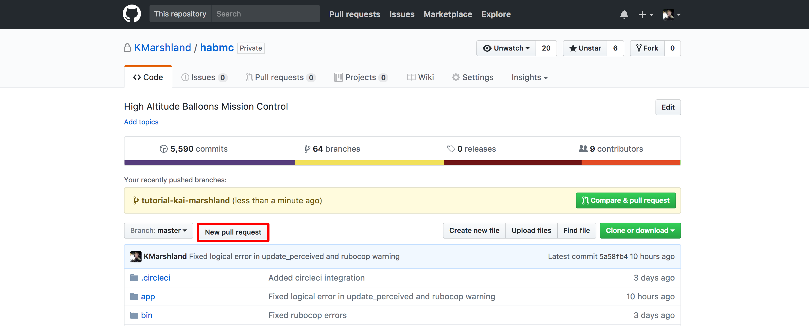
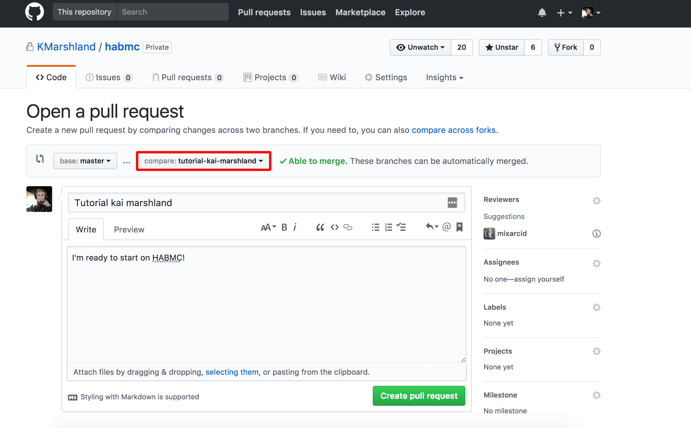

We're almost done... I'd start crying if I didn't know I'd see you working on HABMC and if I weren't an inanimate tutorial.

We do, however, have one last bit of tutorial: checking your code's style and getting it into the codebase

## Using rubocop to check style
Rubocop is the automated style checker.
Run 
```bash
docker-compose run app rubocop
```

It will probably tell you
```text
Offenses:

app/models/tutorial_message.rb:25:39: C: %w-literals should be delimited by [ and ].
  validates :status, inclusion: { in: %w(unsent sending success failure),
                                      ^^^^^^^^^^^^^^^^^^^^^^^^^^^^^^^^^^

215 files inspected, 1 offense detected
```

Let's fix that with the autofix option
```bash
docker-compose run app rubocop -a
```
Autofix can't fix everything, but it sure can fix a lot.

Run rubocop a final time to check that everything is ship-shape:
```bash
docker-compose run app rubocop
```

It should say something like `215 files inspected, no offenses detected`.
If there were any offenses, you'll need to fix them by hand. 

Finally, add your changes to git
```bash
git add -A
git commit -m 'Fixed style'
```

## Pushing
First things first, run
```bash
git pull origin master
```
This makes sure any changes someone else has made in master get applied to your code too.

Now push your own code (upload it to github). Don't forget to change `your-name` to your name!
```bash
git push origin tutorial-your-name
```

## Making a pull request
A pull request is something that lets someone review your code and merge it in to the real codebase.
On [https://github.com/KMarshland/habmc](https://github.com/KMarshland/habmc), click "New Pull Request"



Then, select your branch in the compare dropdown.



Enter a title and description that helps explain what your branch is doing, then click "Create Pull Request".
It will run rubocop in the cloud and reject it if it has bad style.
You will see a little green check mark if it passed.

At this point, it's in my hands (it'll send me an email, but feel free to poke @kai on slack if you want it reviewed sooner). 
I'll have a look at the code, and, if everything looks good, merge it in and deploy it!

## What now?
HABMC is a huge codebase, with opportunities for algorithms, scalability, natural language processing, security, machine learning... the list goes on.
But for now, you're done with the tutorials.
Wowweee. 
The next step is to start writing features for HABMC!

- Join #habmc on slack
- Ask @kai for project ideas and specs, or come up with one of your own!

